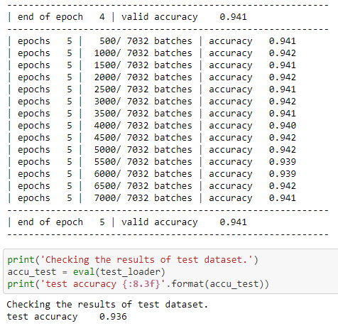
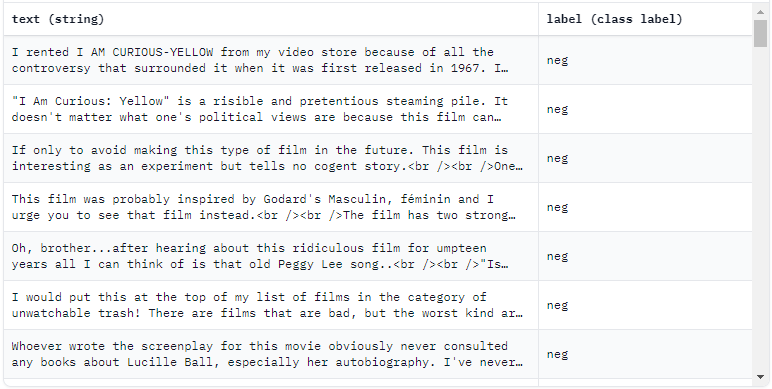

# Session5 - Assignment

## Objective

Look at the [code](https://colab.research.google.com/drive/1z2N6ipI6n6t1ivprJtugDeqKrCM2NPFy?usp=sharing) that we covered in the class today.

- Pick any 2 datasets (except AG_NEWS) from torchtext.datasets and train your model on them achieving 50% more accuracy than random prediction. 
- Upload to Github with a proper readme file describing your datasets, and showing your logs as well. 

## Dataset 1: SogouNews  

- **Dataset Summary:**    
  - The Sogou News dataset is a mixture of 2,909,551 news articles from the SogouCA and SogouCS news corpora, in 5 categories. The number of training samples selected for each class is 90,000 and testing 12,000. Note that the Chinese characters have been converted to Pinyin. classification labels of the news are determined by their domain names in the URL. For example, the news with URL http://sports.sohu.com is categorized as a sport class.
  - Sample
  - Datatypes
    - title: a string feature.
    - content: a string feature.
    - label: a classification label, with possible values including sports (0), finance (1), entertainment (2), automobile (3), technology (4).
  - train: 450000 test: 60000
- **Results**
    - Notebook : [Session5_END_SogouNews.ipynb](Session5_END_SogouNews.ipynb)
    - Accuracy Validation: 94% and Test: 93.6%
      

## Dataset 2: IMBD  

- **Dataset Summary:**    
  - Large Movie Review Dataset. This is a dataset for binary sentiment classification containing substantially more data than previous benchmark datasets. We provide a set of 25,000 highly polar movie reviews for training, and 25,000 for testing. There is additional unlabeled data for use as well.
  - Sample
  - Datatypes
    - title: a string feature.
    - content: a string feature.
    - label: a classification label, with possible values including sports (0), finance (1), entertainment (2), automobile (3), technology (4).
  - train: 450000 test: 60000
- **Results**
    - Notebook : [Session5_END_IMDB.ipynb](Session5_END_IMDB.ipynb)
    - Accuracy Validation: 87.5% and Test: 86.7%
      